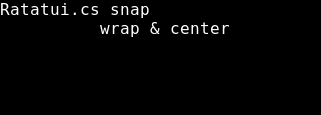
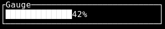
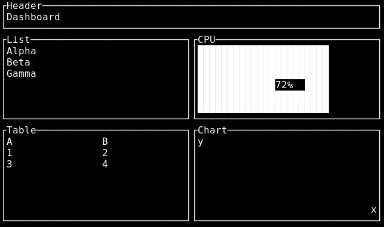

Ratatui.cs — .NET/C# Terminal UI (TUI) Library powered by Rust Ratatui


[](https://github.com/holo-q/Ratatui.cs/actions/workflows/guard.yml)
[](https://github.com/holo-q/Ratatui.cs/actions/workflows/snapshots.yml)
[](https://github.com/holo-q/Ratatui.cs/actions/workflows/snapshots-on-ci.yml)
[](https://github.com/holo-q/Ratatui.cs/actions/workflows/ci-030.yml)
[](https://github.com/holo-q/Ratatui.cs/releases)
[](https://www.nuget.org/packages/Ratatui.cs)
[](https://www.nuget.org/packages/Ratatui.cs)

High-performance, cross-platform Terminal UI (TUI) for .NET and C#. Ratatui.cs exposes the battle-tested Rust Ratatui engine over a stable FFI with an idiomatic C# API. Build rich console apps with widgets, layout, keyboard/mouse events, batched frame rendering, and headless snapshot testing. Works on Windows, Linux, and macOS.

Features
- Rich widgets: Paragraph, List (stateful), Table (stateful), Gauge, Tabs, BarChart, Sparkline, Scrollbar.
- Input events: Keyboard and mouse (down/up/drag/move/scroll + modifiers), resize.
- Rendering: Draw into rects, batched DrawFrame for multiple widgets.
- Testing: Headless renderers for widgets and composite frames; deterministic event injection.
- Ergonomics: Vec2i swizzles, Rect aliases (x/y/w/h), simple C# layout helpers.
- Cross-platform: Prebuilt native binaries per RID (linux-x64, win-x64, osx-x64, osx-arm64).

Why Ratatui.cs?
- Performance first: powered by Rust Ratatui engine, efficient rendering + input.
- Production ready: headless snapshot testing for CI with deterministic results.
- Idiomatic C#: fluent, disposable widgets and safe handles, simple layout.
- Cross‑platform binaries: Windows, Linux, macOS with per‑RID native assets.

Install
- NuGet: `dotnet add package Ratatui.cs`

Quickstart
```csharp
using Ratatui;

using var term = new Terminal();
using var p = new Paragraph("Hello from C#").Title("Demo");
var (w,h) = term.Size();
term.Draw(p, new Rect(0,0,w,h));

// Batched frame
term.DrawFrame(
  DrawCommand.Paragraph(p, new Rect(0,0,w/2,h)),
  DrawCommand.Gauge(new Gauge().Ratio(0.42f).Title("Load"), new Rect(w/2,0,w/2,3))
);
```

Headless snapshots (CI-friendly)
```csharp
using Ratatui.Testing;
using var table = new Table().Title("T").Headers("A","B").AppendRow("1","2");
var snapshot = Headless.RenderTable(30, 6, table);
Console.WriteLine(snapshot);
```

Snapshots

These screenshots are auto‑generated by CI after a green run. The snapshots-on-ci workflow builds the native engine, runs our headless renderers, converts the ASCII frames to PNG, and commits them back to this repo. Treat them as a living “seal of approval” that the entire stack (Rust FFI + C# API + widgets) is working end‑to‑end on real CI.

<table>
  <tr>
    <td align="center">
      <b>Paragraph</b><br/>
      
    </td>
    <td align="center">
      <b>Table</b><br/>
      
    </td>
  </tr>
  <tr>
    <td align="center">
      <b>Chart</b><br/>
      
    </td>
    <td align="center">
      <b>Tabs</b><br/>
      
    </td>
  </tr>
  <tr>
    <td align="center">
      <b>Gauge</b><br/>
      
    </td>
    <td align="center">
      <b>Combined (mini dashboard)</b><br/>
      
    </td>
  </tr>
  
</table>

What this is
- Native Rust cdylib (`native/ratatui_ffi`) with a stable C ABI over Ratatui.
- Idiomatic .NET library (`src/Ratatui`) with SafeHandles and builders.
- Headless snapshot rendering for CI and smoke tests (no terminal required).

Using in your app (source)
- Add a ProjectReference to `src/Ratatui/Ratatui.csproj`.
- Ensure the native library is discoverable (Resolver searches `runtimes/<rid>/native/` and common dev `target/` paths). You can override with `RATATUI_FFI_DIR` env var.

Using via NuGet (CI-packaged)
- CI builds native libraries for: linux-x64, win-x64, osx-x64, osx-arm64.
- NuGet includes RID-specific native assets under `runtimes/<rid>/native/`.
- After CI, download the `.nupkg` from artifacts or releases and reference it in your project.

Snapshots: how they are generated
- Ad-hoc: run the "snapshots" workflow (workflow_dispatch). It builds the native lib, runs the snapshots example to emit ASCII, converts to PNG via ImageMagick, and uploads both as artifacts.
- On release tags (vX.Y.Z): the "snapshots-release" workflow generates PNGs and commits them to `docs/assets/snapshots`, keeping this README section's images fresh.

Local dev (build from source)
1) Build native
   - `cd native/ratatui_ffi && cargo build` (or `cargo build --release`)
2) Run examples
   - Interactive hello: `dotnet run --project examples/Hello/Hello.csproj`
   - Interactive gallery (tabs + list + table + gauge + sparkline): `dotnet run --project examples/Gallery/Gallery.csproj`
   - Headless snapshots: `dotnet run --project examples/Smoke/Smoke.csproj`
   - Composite headless: `dotnet run --project examples/SmokeFrame/SmokeFrame.csproj`
   - If you see DllNotFoundException, point the loader to your native build:
     - `export RATATUI_FFI_DIR=$(pwd)/native/ratatui_ffi/target/debug` (or `.../release`)
     - Or set `RATATUI_FFI_PATH` to the full path of the built library (`libratatui_ffi.so`/`.dylib` or `ratatui_ffi.dll`).

CI: Build native + pack NuGet
- Workflow: `.github/workflows/ci.yml`
- Jobs:
  - Build native per RID (linux-x64, win-x64, osx-x64, osx-arm64) and upload artifacts.
  - Pack job downloads artifacts, copies them into `src/Ratatui/runtimes/<rid>/native/`, and runs `dotnet pack`.
  - Outputs a `.nupkg` under `artifacts/`; publishes to GitHub Packages on tags and main; optionally to nuget.org on tags.

Publishing and feeds
- GitHub Packages (default): the CI publishes on tags (vX.Y.Z) and on main/master to `https://nuget.pkg.github.com/holo-q/index.json`.
  - Add the source (once):
    - `dotnet nuget add source https://nuget.pkg.github.com/holo-q/index.json -n holo-q -u <github-username> -p <github-personal-access-token> --store-password-in-clear-text`
  - Install: `dotnet add package Ratatui.cs --version <x.y.z>`
- nuget.org (optional): if `NUGET_API_KEY` is set in repo secrets, tags publish to nuget.org as well.

0.30 alpha preview (opt-in)
- A preview workflow builds Ratatui.cs against ratatui 0.30 (FFI submodule branch `ratatui-0.30`) and publishes a prerelease package to GitHub Packages: `0.2.0-alpha.[run]`.
- Add GitHub Packages source (once):
  - `dotnet nuget add source https://nuget.pkg.github.com/holo-q/index.json -n holo-q -u <gh-username> -p <gh-token> --store-password-in-clear-text`
- Install alpha:
  - `dotnet add package Ratatui.cs --version 0.2.0-alpha.* --source holo-q`
- Notes: Scrollbar APIs default on; newer Table alignment options planned once ratatui 0.30 GA stabilizes.

Notes
- Native library name: `ratatui_ffi` (`libratatui_ffi.so`/`.dylib` or `ratatui_ffi.dll`).
- Loader search order: application base, `runtimes/<rid>/native/`, dev `native/ratatui_ffi/target/{debug,release}`, or `RATATUI_FFI_DIR`.
- Layout: simple C# helpers in `Ratatui.Layout`. For full parity, use Rect math or add your own helpers as needed.

Comparison
- Spectre.Console: fantastic for rich console output (tables, markup, prompts). Ratatui.cs targets interactive, real‑time TUIs with a retained‑mode widget model, robust layout, and headless snapshot testing. If you need a dynamic dashboard or app‑like terminal UI, Ratatui.cs shines.
- Terminal.Gui: pure C# and proven. Ratatui.cs leverages the high‑performance Rust Ratatui engine via FFI for fast rendering, a wide widget set, and deterministic headless tests. Choose Ratatui.cs for cross‑platform speed and CI‑friendly rendering.
