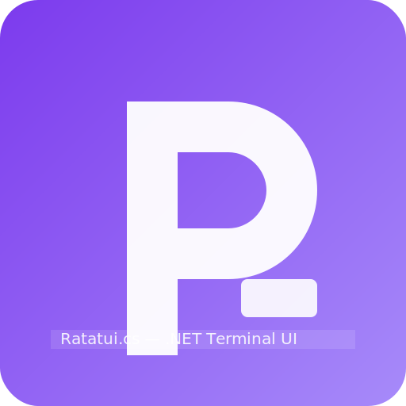

Ratatui.cs — .NET/C# Terminal UI (TUI) powered by Rust Ratatui

[](https://www.nuget.org/packages/Ratatui.cs)
[](https://github.com/holo-q/Ratatui.cs/actions/workflows/ci.yml)
[](https://crates.io/crates/ratatui_ffi)

High-performance, cross-platform Terminal UI for .NET and C#. Exposes the Rust Ratatui engine over FFI with a friendly, idiomatic C# API. Build rich console apps with widgets, layout, keyboard/mouse events, batched frame rendering, and headless snapshot testing.

Features

- Core widgets: Paragraph, List, Table, Gauge, Tabs, BarChart, Sparkline, Chart
- Terminal helpers: init/clear, draw-in-rect, batched frame drawing
- Events: key, mouse, resize; injection for automation/tests
- Styles: colors + modifiers; simple layout helpers and rect math
- Headless rendering: snapshot widgets or full frames to ASCII
- Cross-platform native loading: robust resolver + env var overrides

Ergonomics (C#)

- RAII terminal toggles: `Raw(true)`, `AltScreen(true)`, `ShowCursor(false)`, `Viewport` property; safe unwind on `Dispose`.
- Uniform borders/padding/alignment: `BlockAdv` + `WithBlock(...)` extensions on widgets; zero allocations.
- Batch‑friendly APIs: append spans/lines/rows in one call to reduce interop overhead (see `Batching.WithFfiSpans` and wrappers like `Paragraph.AppendSpans`, `List.AppendItems`, `Tabs.SetTitlesSpans`).
- Headless helpers: `Ratatui.Testing.Headless` methods render widgets/frames deterministically for tests.
- See the full guide in `docs/csharp-ergonomics.md` for patterns, performance tips, and examples.

Why Ratatui.cs?

- Rust‑powered performance with Ratatui engine and efficient FFI.
- Headless snapshot rendering for deterministic, CI‑friendly tests.
- Fluent, idiomatic C# API with disposable widgets and helpers.
- Prebuilt native binaries for Windows, Linux, and macOS.

Install

- `dotnet add package Ratatui.cs`

Quickstart

Interactive draw-in-rect

```
using Ratatui;

using var term = new Terminal();
term.Clear();

using var para = new Paragraph("Hello from Ratatui.cs!\nThis is Ratatui via Rust FFI.")
    .Title("Demo");

term.DrawIn(para, new Rect(2, 1, 44, 6));
```

Headless snapshot (tests)

```
using Ratatui;

using var para = new Paragraph("Snapshot me").Title("Test");
var ascii = Headless.Render(
    new Rect(0, 0, 24, 5),
    DrawCommand.Paragraph(para, new Rect(0, 0, 24, 5))
);
// Assert on `ascii` or save to file for golden tests
```

Batched frame (multiple widgets)

```
using var list = new List().Title("Items").Items("A", "B", "C");
using var chart = new Chart().Title("Line").Line("L1", new [] { (0.0,1.0), (1.0,2.0) });

var rect = new Rect(0, 0, 60, 12);
var left = new Rect(0, 0, 30, rect.Height);
var right = new Rect(30, 0, 30, rect.Height);

var ascii = Headless.Render(
    rect,
    DrawCommand.List(list, left),
    DrawCommand.Chart(chart, right)
);
```

Events

```
await foreach (var evt in term.Events())
{
    if (evt is KeyEvent k && k.Code == KeyCode.Esc) break;
}
```

Native loading

- Ships native libs under `runtimes/<rid>/native`.
- Resolver also searches local dev build outputs and supports overrides:
  - `RATATUI_FFI_DIR` = directory containing the native library
  - `RATATUI_FFI_PATH` = full path to the library file

Supported RIDs

- linux-x64, linux-arm64
- linux-musl-x64 (Alpine-compatible), linux-musl-arm64 (best-effort)
- win-x64, win-arm64
- osx-x64, osx-arm64

Troubleshooting

- DllNotFoundException: set `RATATUI_FFI_DIR` to where your native lib lives, or ensure your app deploys `runtimes/<rid>/native/*ratatui_ffi*` alongside your binaries.
- Version/feature detection: we call `ratatui_ffi_version(&maj,&min,&patch)` and `ratatui_ffi_feature_bits()` at load to ensure compatibility and enable optional features.
- Headless rendering returns UTF-8 text; ensure your asserts treat it as UTF-8.

FFI coverage enforcement

- The build runs a strict coverage checker to ensure every `ratatui_*` FFI export has a matching `DllImport` in the C# bindings. Missing or stale entries fail the build.
- The checker scans `native/ratatui-ffi/src/**/*.rs` for `#[no_mangle] extern "C" fn` and diff’s against compiled P/Invoke entry points using reflection without loading the native library.
- To bypass temporarily (not recommended), build with `-p:SkipFfiCoverage=true`.

Links

- Repo: https://github.com/holo-q/Ratatui.cs
- FFI (Rust): https://github.com/holo-q/ratatui-ffi
- Ratatui (upstream): https://github.com/ratatui-org/ratatui

C# Idioms & Performance

- Prefer Span/ReadOnlySpan overloads where available to avoid allocations. Most append/set APIs have `ReadOnlySpan<byte>` UTF‑8 variants.
- Use BlockAdv for borders/padding/title alignment with zero extra allocations:
  - Example: `para.WithBlock(new BlockAdv(Borders.All, BorderType.Plain, Padding.All(1), Alignment.Center));`
  - Titles can still be set via fast UTF‑8 span overloads (`Title(ReadOnlySpan<byte>)`).
- Batch where possible:
  - List/Table/Tabs/Paragraph have batching helpers internally; push multiple items/spans in one call to reduce interop overhead.
- Colors: prefer `Style` with named colors for zero marshaling. When you need RGB/indexed, use helpers backing native encoding (`Native.RatatuiColorRgb`, `Native.RatatuiColorIndexed`) and construct `Style` from raw values at the interop boundary.
- State: use `ListState`/`TableState` for selection/offset to keep UI logic and drawing decoupled and efficient.
- Terminal: wrap raw/alt/cursor toggles in a `using var term = new Terminal();` and call `term.Raw(true).AltScreen(true)` for safe unwinding in `Dispose`.
- Headless testing: use `Headless.Render(...)`, `RenderStylesEx(...)`, and `RenderCells(...)` to snapshot without the console; these are allocation‑light and deterministic.

Notes on native interop vs C# sugar

- The native layer is 1:1 with ratatui_ffi for stability and portability (explicit ownership, flat C ABI).
- The C# layer adds ergonomics (fluent methods, `BlockAdv`, Span‑based overloads, SafeHandles) while preserving performance:
  - All hot paths avoid heap allocations where possible (stackalloc/ArrayPool; zero‑copy spans).
  - Structs (`Rect`, `Style`, `Padding`, etc.) are immutable value types passed by readonly ref where sensible.
  - Batching APIs minimize the number of P/Invoke calls.
- If you need to drop to native calls for something niche, consider filing an issue or PR to expose a zero‑cost C# helper — we aim for parity without sacrificing ergonomics.

License

MIT

Comparison

- Spectre.Console: great for rich text, tables, and prompts when building traditional CLI tools. Ratatui.cs is focused on interactive TUI applications with a retained widget tree, real‑time rendering, and headless snapshot testing.
- Terminal.Gui: mature C# TUI. Ratatui.cs taps into Rust Ratatui for performance and feature coverage, while exposing an idiomatic C# API and prebuilt native binaries for Windows, Linux, and macOS.
